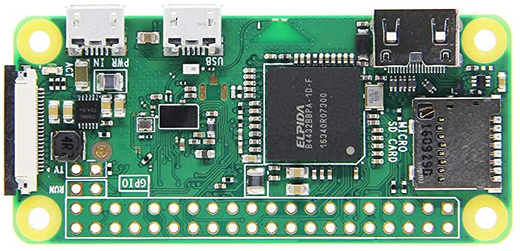

# Introduction

In this project we are going to build a small weather station using a Raspberry Pi Zero:



# List of meterials

We will need a [Raspberry Pi Zero W](https://www.raspberrypi.org/products/raspberry-pi-zero-w/) and a [Scroll pHAT HD](https://shop.pimoroni.com/products/scroll-phat-hd?variant=2380803833866). It is also possible to get all the components together as a [kit](https://thepihut.com/collections/raspberry-pi-kits-and-bundles/products/scroll-bot-pi-zero-w-project-kit). This bundle comes with a cool case in order to assembly all the components.

We also will need a micro SD card with [Raspberry Pi OS](https://www.raspberrypi.org/software/operating-systems/) installed.

# Weather conditions API service

[OpenWeather](https://openweathermap.org/) offers an API service to get the [current weather data](https://openweathermap.org/current). In the free plan, it is possible to make till 60 calls by minute; more than we need for our purpose.

# Required libraries

1. [Python library for Scroll pHAT HD](https://github.com/pimoroni/scroll-phat-hd): Library to control the display. There is a [tutorial](https://learn.pimoroni.com/tutorial/sandyj/getting-started-with-scroll-phat-hd) on using Scroll pHAT HD.
2. [Requests](https://docs.python-requests.org/en/latest/user/quickstart/): Library to call the weather API.

# The program

First, the display is configured to retain the text at the end of the execution:

```python
sphd.rotate(180)
sphd.set_clear_on_exit(False)
```

The weather information service is then called using the `get_weather_data` function. It is important to set the values of the following variables:

```python
app_id = "xxx" #Openweathermap API Key
query = "city" #City name
```

If the API call is OK, the text to be shown on the display is constructed by means of the `build_text` function. Cuurent time, prevailing weather condition, temperature and humidity are displayed. On the contrary, if the API call is wrong, only the time is displayed.

Finally, the information is shown on the display using the `display_text` function.

# Scheduling

When executed, the script only shows the current time and weather conditions. We need to schedule the execution every minute in order to get a working clock. For this purpose, we will use cron, a time-based job scheduler for Unix-based systems. We have to edit the crontab file in order to schedule the execution of the script:

```text
crontab -e
```

And we need to add the following line:

```text
* * * * * python /path-to-script/pi_clock.py
```